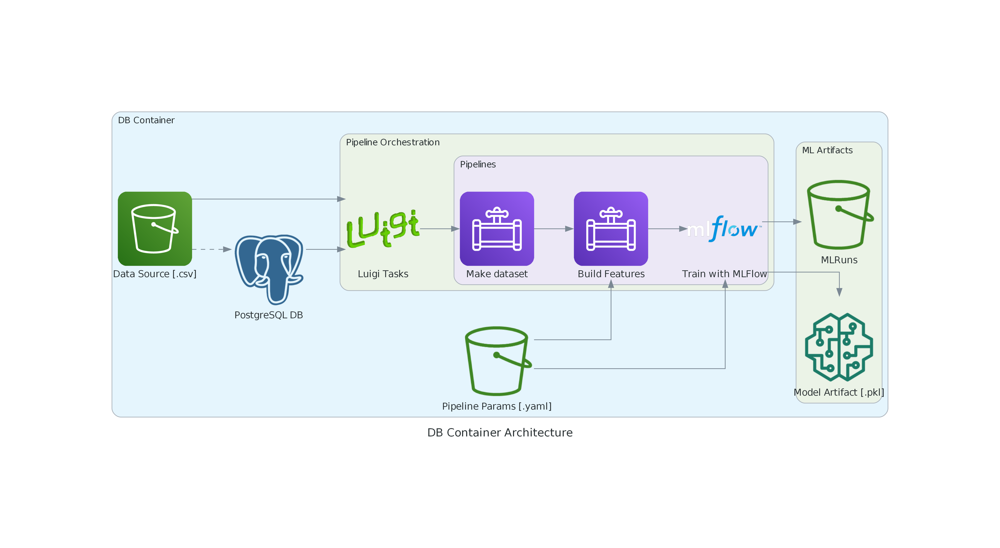
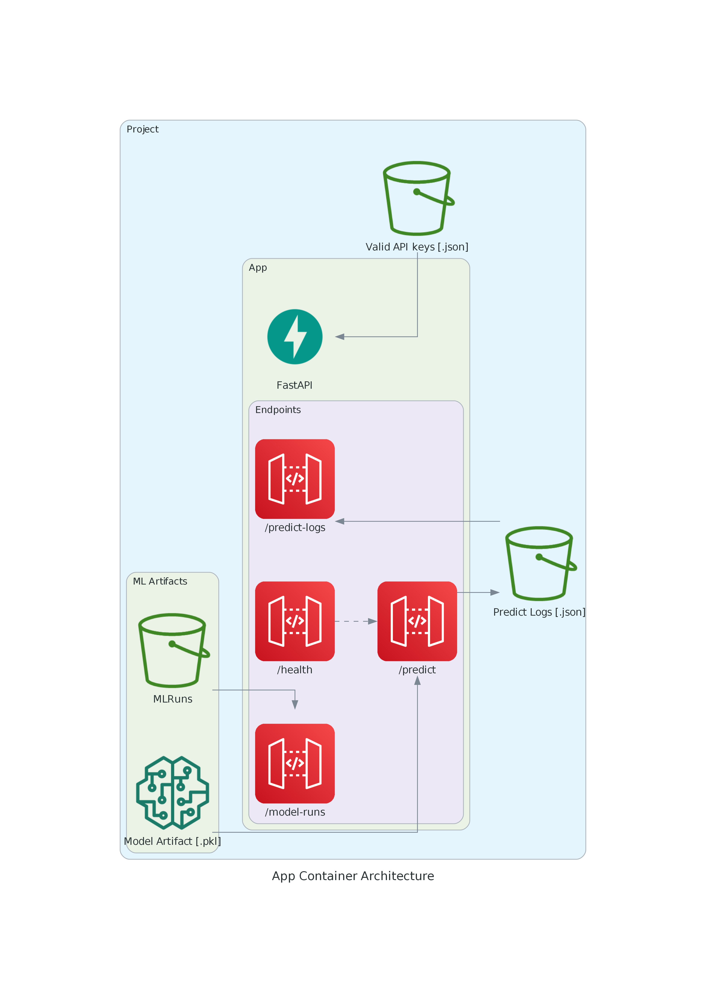
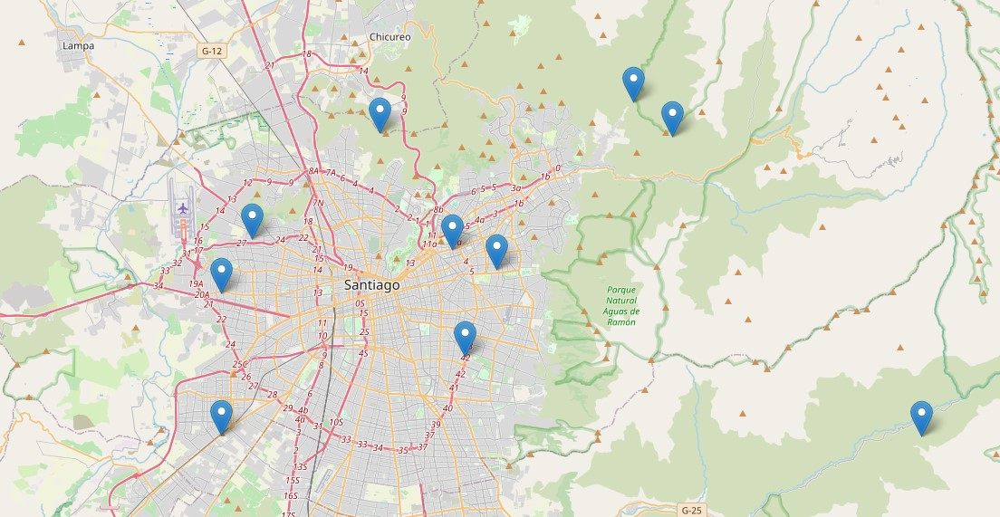

# Table of Contents
- [Table of Contents](#table-of-contents)
- [Property Friends Real Estate Case](#property-friends-real-estate-case)
- [Software Requirements](#software-requirements)
- [Initial Setup](#initial-setup)
- [Running the app](#running-the-app)
  - [Data and model setup](#data-and-model-setup)
    - [1. Startup Docker](#1-startup-docker)
    - [2. Build images and start containers](#2-build-images-and-start-containers)
    - [3. Create a model artifact](#3-create-a-model-artifact)
  - [App usage](#app-usage)
    - [API key authentication](#api-key-authentication)
    - [Testing endpoints](#testing-endpoints)
- [Architecture and technical aspects](#architecture-and-technical-aspects)
  - [Project structure](#project-structure)
  - [ML](#ml)
    - [Input Data](#input-data)
    - [Data/ML Pipelines](#dataml-pipelines)
      - [Make Dataset](#make-dataset)
      - [Build Features](#build-features)
      - [Train Model](#train-model)
  - [App](#app)
    - [Api key authentication](#api-key-authentication-1)
    - [Predict](#predict)
    - [Predict logs](#predict-logs)
    - [Model run logs](#model-run-logs)
  - [Code Standards and best practices](#code-standards-and-best-practices)
- [Issues with the original notebook and improvements](#issues-with-the-original-notebook-and-improvements)
- [Further improvements](#further-improvements)


# Property Friends Real Estate Case

Property Friends Real Estate Case is a FastAPI-based application designed to receive data with features of real estate properties and use a trained machine learning model to predict the price of the property. The model is based in the one trained in this notebook [Property-Friends-basic-model.ipynb](challenge/Property-Friends-basic-model.ipynb). The application's technical requirements are established in this document [Challenge.md](challenge/Challenge.md)

# Software Requirements

- Git, to clone the repository. For reference, I used v2.30.1 in Windows.
- Docker and Docker Compose for desktop. For reference, I used Docker v24.0.5 and Docker Compose v2.20.2
- Other requirements are handled within the container (e.g. python dependencies, databases) so the user/host doesn't need to install them.

# Initial Setup

1. Ensure git and docker are installed in your system. You can check in your command-line interface (CLI) of preference (cmd, powershell, shell, etc) by running:

    ```
    git --version
    docker --version
    docker-compose --version
    ```

    The output should show something like `git version 2.30.1.windows.1`, `Docker version 24.0.5, build ced0996` and `Docker Compose version v2.20.2-desktop.1`.

2. Clone the repository using Git and move to the root directory.

    ```
    git clone https://github.com/igonzalezperez/property_friends_real_estate_case.git
    cd property_friends_real_estate_case
    ```
    All CLI commands from now on should be run at the root of the project.

3. Create a `.env` file in the project's root directory using the values from [.env.example](.env.example). You can do this through CLI commands with 
    ```
    copy .env.example .env
    ```
    for Windows, and
    ```
    cp .env.example .env
    ```
    for Unix-based systems (macOS, Linux).
   
4. If you have the original `train.csv` and `test.csv` files, place them in the [ml/data/raw/](ml/data/raw/) folder. Otherwise, there are [train.csv.example](ml/data/raw/train.csv.example) and [test.csv.example](ml/data/raw/test.csv.example) files with minimal data for the project to work, although results will not be meaningful or comparable to original notebook, you can copy them and rename the example files to `train.csv` and `test.csv` respectively (the example data is based on the original data schema but rows themselves are fake). You can do it manually or through CLI with the following commands in Windows and Unix respectively:
    ```
    copy ml/data/raw/train.csv.example ml/data/raw/train.csv
    copy ml/data/raw/test.csv.example ml/data/raw/test.csv
    ```

    ```
    cp ml/data/raw/train.csv.example ml/data/raw/train.csv
    cp ml/data/raw/test.csv.example ml/data/raw/test.csv
    ```

# Running the app
## Data and model setup
### 1. Startup Docker
Open the Docker desktop app and wait until it finishes loading, it should take a couple seconds.

### 2. Build images and start containers
Run this command to build and start the docker containers:
```
docker-compose up -d --build
```
This will take about a 2 minutes when run for the first time. The process runs two containers, one for the app itself and another one for the postgres database, the logs for each one upon startup can be inspected with:
```
docker-compose logs app
docker-compose logs db
```
And they should look like this:

<details>
  <summary><i>docker-compose logs app</i>. Click to expand/collapse</summary>
<pre><code>
app  | INFO:     Started server process [1]
app  | INFO:     Waiting for application startup.
app  | 2024-01-22 14:18:00.039 | WARNING  | app.services.predict:load:73 - Machine learning model at ml/models/trained_model/model.pkl doesn't exist
app  | INFO:     Application startup complete.
app  | INFO:     Uvicorn running on http://0.0.0.0:8080 (Press CTRL+C to quit)
  </code></pre>
</details>
<details>
  <summary><i>docker-compose logs db</i>. Click to expand/collapse</summary>
<pre><code>
db  | The files belonging to this database system will be owned by user "postgres".
db  | This user must also own the server process.
db  | 
db  | 
db  | The database cluster will be initialized with locale "en_US.utf8".
db  | The default database encoding has accordingly been set to "UTF8".
db  | The default text search configuration will be set to "english".
db  | 
db  | 
db  | Data page checksums are disabled.
db  | 
db  |
db  | fixing permissions on existing directory /var/lib/postgresql/data ... ok
db  | creating subdirectories ... ok
db  | selecting dynamic shared memory implementation ... posix
db  | selecting default max_connections ... 100
db  | selecting default shared_buffers ... 128MB
db  | selecting default time zone ... Etc/UTC
db  | creating configuration files ... ok
db  | running bootstrap script ... ok
  </code></pre>
</details>

At this point, both the API and the DB containers are available, and endpoints can receive requests, but we don't have a model yet so we'll create one first. Alternatively, you can check the endpoints now at <http://localhost:8080/docs> and check that the endpoints correctly handle requests when there is no model available.

> The app relies on the .env file, which is loaded when starting the container, if an environment variable needs to be changed the container must be restarted, this can be done with the following commands:
```
docker-compose down
docker-compose up -d
```

### 3. Create a model artifact
Run ML pipelines to setup postgres DB tables, load data, transform it, train predictive model and store it. First we need to open a CLI within the container with this command:
```
docker exec -it app /bin/bash
```
The CLI will display something like `root@b2e2a41e9a7c:/real-estate-price-prediction#`, in there run this:
```
make ml-pipeline
```
When the pipeline finishes (~1 minute), the model and it's logs will be stored and available for the API endpoints. At the end of the process these logs should appear:

```
Scheduled 3 tasks of which:
* 3 ran successfully:
    - 1 BuildFeatures(...)
    - 1 MakeDataset(input_dir=ml/data/raw, input_file=train.csv, input_test_file=test.csv, output_dir=ml/data/interim)
    - 1 TrainModel()

This progress looks :) because there were no failed tasks or missing dependencies

===== Luigi Execution Summary =====
```
You can exit the container CLI by entering `exit`.

*In order to train a new model, you can run `make ml-pipeline-base`, this will log a new model, so there are two models in the history, and it will replace the active one, which is the one consumed by the API. Running just `make ml-pipeline` again won't do anything (see [Data/ML Pipelines](#data/ml-pipelines)).*

The complete logs can be inspected below.
<details>
  <summary><i>make ml-pipeline</i>. Click to expand/collapse</summary>
<pre><code>
poetry run python ml/pipelines/luigi_tasks.py
DEBUG: Checking if TrainModel() is complete
/.venv/lib/python3.11/site-packages/luigi/parameter.py:296: UserWarning: Parameter "input_dir" with value "ml/data/interim" is not of type string.
  warnings.warn('Parameter "{}" with value "{}" is not of type string.'.format(param_name, param_value))
/.venv/lib/python3.11/site-packages/luigi/parameter.py:296: UserWarning: Parameter "output_data_dir" with value "ml/data/processed" is not of type string.
  warnings.warn('Parameter "{}" with value "{}" is not of type string.'.format(param_name, param_value))
DEBUG: Checking if BuildFeatures(input_dir=ml/data/interim, input_file=interim_train.csv, input_test_file=interim_test.csv, output_data_dir=ml/data/processed, output_model_dir=ml/models) is complete
INFO: Informed scheduler that task   TrainModel__99914b932b   has status   PENDING
DEBUG: Checking if MakeDataset(input_dir=ml/data/raw, input_file=train.csv, input_test_file=test.csv, output_dir=ml/data/interim) is complete
INFO: Informed scheduler that task   BuildFeatures_ml_data_interim_interim_train_cs_interim_test_csv_8a8efa73a6   has status   PENDING
INFO: Informed scheduler that task   MakeDataset_ml_data_raw_train_csv_test_csv_2f6931b3c8   has status   PENDING
INFO: Done scheduling tasks
INFO: Running Worker with 1 processes
DEBUG: Asking scheduler for work...
DEBUG: Pending tasks: 3
INFO: [pid 43] Worker Worker(salt=3907377044, workers=1, host=f6c763ecf6b5, username=root, pid=43) running   MakeDataset(input_dir=ml/data/raw, input_file=train.csv, input_test_file=test.csv, output_dir=ml/data/interim)
2024-01-22 14:26:02.366 | INFO     | ml.pipelines.make_dataset:init_raw_data_table:53 - Creating `raw_data` table if it doesn't exist
2024-01-22 14:26:02.514 | INFO     | ml.pipelines.make_dataset:init_raw_data_table:60 - Table `raw_data` is empty, inserting data
2024-01-22 14:26:03.360 | INFO     | ml.pipelines.make_dataset:init_raw_data_table:71 - 

        +--------------+--------------+-------------------+------------+-----------+--------------+------------+-------------+---------+------------+
| type         | sector       |   net_usable_area |   net_area |   n_rooms |   n_bathroom |   latitude |   longitude |   price | is_train   |
+==============+==============+===================+============+===========+==============+============+=============+=========+============+
| departamento | vitacura     |               140 |        170 |         4 |            4 |   -33.4012 |    -70.5806 |   11900 | True       |
+--------------+--------------+-------------------+------------+-----------+--------------+------------+-------------+---------+------------+
| casa         | la reina     |               225 |        659 |         4 |            3 |   -33.4434 |    -70.5692 |   17900 | True       |
+--------------+--------------+-------------------+------------+-----------+--------------+------------+-------------+---------+------------+
| casa         | las condes   |               110 |        200 |         3 |            3 |   -33.3932 |    -70.5505 |   10300 | True       |
+--------------+--------------+-------------------+------------+-----------+--------------+------------+-------------+---------+------------+
| departamento | lo barnechea |               250 |        250 |         3 |            4 |   -33.3567 |    -70.5426 |   30000 | True       |
+--------------+--------------+-------------------+------------+-----------+--------------+------------+-------------+---------+------------+
| departamento | providencia  |                70 |         79 |         2 |            2 |   -33.4442 |    -70.6132 |    5700 | True       |
+--------------+--------------+-------------------+------------+-----------+--------------+------------+-------------+---------+------------+
                
2024-01-22 14:26:03.360 | INFO     | ml.pipelines.make_dataset:pipeline:116 - Reading data from DB
2024-01-22 14:26:03.619 | INFO     | ml.pipelines.make_dataset:pipeline:143 - Merging train-test data and shuffling rows to create new split
2024-01-22 14:26:04.114 | INFO     | ml.pipelines.make_dataset:pipeline:156 - Dropping all rows with target less or equal than 0
2024-01-22 14:26:04.115 | INFO     | ml.pipelines.make_dataset:pipeline:162 - Dropped 1 train cols
2024-01-22 14:26:04.116 | INFO     | ml.pipelines.make_dataset:pipeline:163 - Dropped 0 test cols
2024-01-22 14:26:04.118 | INFO     | ml.pipelines.make_dataset:pipeline:168 - Saving data to ml/data/interim/interim_train.csv
2024-01-22 14:26:04.118 | INFO     | ml.pipelines.make_dataset:pipeline:169 - Saving data to ml/data/interim/interim_test.csv
2024-01-22 14:26:04.252 | SUCCESS  | ml.pipelines.make_dataset:pipeline:172 - Successfully ran MakeDataset
INFO: [pid 43] Worker Worker(salt=3907377044, workers=1, host=f6c763ecf6b5, username=root, pid=43) done      MakeDataset(input_dir=ml/data/raw, input_file=train.csv, input_test_file=test.csv, output_dir=ml/data/interim)
DEBUG: 1 running tasks, waiting for next task to finish
INFO: Informed scheduler that task   MakeDataset_ml_data_raw_train_csv_test_csv_2f6931b3c8   has status   DONE
DEBUG: Asking scheduler for work...
DEBUG: Pending tasks: 2
INFO: [pid 43] Worker Worker(salt=3907377044, workers=1, host=f6c763ecf6b5, username=root, pid=43) running   BuildFeatures(input_dir=ml/data/interim, input_file=interim_train.csv, input_test_file=interim_test.csv, output_data_dir=ml/data/processed, output_model_dir=ml/models)
2024-01-22 14:26:04.262 | INFO     | ml.pipelines.build_features:pipeline:73 - Load data pipeline config.
2024-01-22 14:26:04.267 | INFO     | ml.pipelines.build_features:pipeline:75 - Start processing data.
2024-01-22 14:26:04.267 | INFO     | ml.pipelines.build_features:pipeline:79 - Reading data from: ml/data/interim/interim_train.csv
2024-01-22 14:26:04.285 | INFO     | ml.pipelines.build_features:pipeline:82 - Data cols: ['type', 'sector', 'net_usable_area', 'net_area', 'n_rooms', 'n_bathroom', 'latitude', 'longitude', 'price', 'is_train']
2024-01-22 14:26:04.285 | INFO     | ml.pipelines.build_features:pipeline:83 - Feature cols: ['type', 'sector', 'net_usable_area', 'net_area', 'n_rooms', 'n_bathroom', 'latitude', 'longitude']
2024-01-22 14:26:04.285 | INFO     | ml.pipelines.build_features:pipeline:84 - Categorical cols: ['type', 'sector']
2024-01-22 14:26:04.285 | INFO     | ml.pipelines.build_features:pipeline:85 - Numerical cols: ['net_usable_area', 'net_area', 'n_rooms', 'n_bathroom', 'latitude', 'longitude']
2024-01-22 14:26:04.285 | INFO     | ml.pipelines.build_features:pipeline:86 - Target col: price
2024-01-22 14:26:04.285 | INFO     | ml.pipelines.build_features:pipeline:104 - Fitting preprocessing pipeline
2024-01-22 14:26:04.326 | INFO     | ml.pipelines.build_features:pipeline:109 - Succesfully fitted pipeline: 
Pipeline(steps=[('preprocessor',
                 ColumnTransformer(transformers=[('categorical',
                                                  TargetEncoder(),
                                                  ['type', 'sector']),
                                                 ('numerical', StandardScaler(),
                                                  ['net_usable_area',
                                                   'net_area', 'n_rooms',
                                                   'n_bathroom', 'latitude',
                                                   'longitude'])]))])
2024-01-22 14:26:04.337 | INFO     | ml.pipelines.build_features:pipeline:115 - Saving preprocessed data to: ml/data/processed/processed_train.csv
2024-01-22 14:26:04.510 | INFO     | ml.pipelines.build_features:pipeline:118 - Reading data from: ml/data/interim/interim_test.csv
2024-01-22 14:26:04.527 | INFO     | ml.pipelines.build_features:pipeline:129 - Saving preprocessed data to: ml/data/processed/processed_test.csv
2024-01-22 14:26:04.623 | INFO     | ml.pipelines.build_features:pipeline:132 - Saving preprocessing pipeline to: ml/models/preproc_pipeline.joblib
2024-01-22 14:26:04.631 | SUCCESS  | ml.pipelines.build_features:pipeline:135 - Successfully ran BuildFeatures
INFO: [pid 43] Worker Worker(salt=3907377044, workers=1, host=f6c763ecf6b5, username=root, pid=43) done      BuildFeatures(input_dir=ml/data/interim, input_file=interim_train.csv, input_test_file=interim_test.csv, output_data_dir=ml/data/processed, output_model_dir=ml/models)
DEBUG: 1 running tasks, waiting for next task to finish
INFO: Informed scheduler that task   BuildFeatures_ml_data_interim_interim_train_cs_interim_test_csv_8a8efa73a6   has status   DONE
DEBUG: Asking scheduler for work...
DEBUG: Pending tasks: 1
INFO: [pid 43] Worker Worker(salt=3907377044, workers=1, host=f6c763ecf6b5, username=root, pid=43) running   TrainModel()
2024-01-22 14:26:04.641 | INFO     | ml.pipelines.train_model:pipeline:63 - Load data pipeline config.
2024-01-22 14:26:04.646 | INFO     | ml.pipelines.train_model:pipeline:65 - Start building features.
2024-01-22 14:26:04.646 | INFO     | ml.pipelines.train_model:pipeline:72 - Reading preprocessed data from: ml/data/interim/interim_train.csv
2024-01-22 14:26:04.662 | INFO     | ml.pipelines.train_model:pipeline:74 - Reading processing pipeline data from: ml/models/preproc_pipeline.joblib
2024-01-22 14:26:04.667 | INFO     | ml.pipelines.train_model:pipeline:77 - Model Features: ['type', 'sector', 'net_usable_area', 'net_area', 'n_rooms', 'n_bathroom', 'latitude', 'longitude']
2024-01-22 14:26:04.667 | INFO     | ml.pipelines.train_model:pipeline:78 - Model Target: price
2024-01-22 14:26:04.668 | INFO     | ml.pipelines.train_model:pipeline:80 - Model Type: <class 'sklearn.ensemble._gb.GradientBoostingRegressor'>
2024-01-22 14:26:04.668 | INFO     | ml.pipelines.train_model:pipeline:81 - Model Params: {'learning_rate': 0.01, 'n_estimators': 300, 'max_depth': 5, 'random_state': 42, 'loss': 'absolute_error'}
2024-01-22 14:26:04.668 | INFO     | ml.pipelines.train_model:pipeline:86 - Training model: <class 'sklearn.ensemble._gb.GradientBoostingRegressor'> with parameters: {'n_estimators': 300, 'learning_rate': 0.01, 'loss': 'absolute_error', 'criterion': 'friedman_mse', 'min_samples_split': 2, 'min_samples_leaf': 1, 'min_weight_fraction_leaf': 0.0, 'subsample': 1.0, 'max_features': None, 'max_depth': 5, 'min_impurity_decrease': 0.0, 'ccp_alpha': 0.0, 'init': None, 'random_state': 42, 'alpha': 0.9, 'verbose': 0, 'max_leaf_nodes': None, 'warm_start': False, 'validation_fraction': 0.1, 'n_iter_no_change': None, 'tol': 0.0001}
2024/01/22 14:26:04 INFO mlflow.store.db.utils: Creating initial MLflow database tables...
2024/01/22 14:26:05 INFO mlflow.store.db.utils: Updating database tables
INFO  [alembic.runtime.migration] Context impl SQLiteImpl.
INFO  [alembic.runtime.migration] Will assume non-transactional DDL.
INFO  [alembic.runtime.migration] Running upgrade  -> 451aebb31d03, add metric step
INFO  [alembic.runtime.migration] Running upgrade 451aebb31d03 -> 90e64c465722, migrate user column to tags
INFO  [alembic.runtime.migration] Running upgrade 90e64c465722 -> 181f10493468, allow nulls for metric values
INFO  [alembic.runtime.migration] Running upgrade 181f10493468 -> df50e92ffc5e, Add Experiment Tags Table
INFO  [alembic.runtime.migration] Running upgrade df50e92ffc5e -> 7ac759974ad8, Update run tags with larger limit
INFO  [alembic.runtime.migration] Running upgrade 7ac759974ad8 -> 89d4b8295536, create latest metrics table
INFO  [89d4b8295536_create_latest_metrics_table_py] Migration complete!
INFO  [alembic.runtime.migration] Running upgrade 89d4b8295536 -> 2b4d017a5e9b, add model registry tables to db
INFO  [2b4d017a5e9b_add_model_registry_tables_to_db_py] Adding registered_models and model_versions tables to database.
INFO  [2b4d017a5e9b_add_model_registry_tables_to_db_py] Migration complete!
INFO  [alembic.runtime.migration] Running upgrade 2b4d017a5e9b -> cfd24bdc0731, Update run status constraint with killed
INFO  [alembic.runtime.migration] Running upgrade cfd24bdc0731 -> 0a8213491aaa, drop_duplicate_killed_constraint
INFO  [alembic.runtime.migration] Running upgrade 0a8213491aaa -> 728d730b5ebd, add registered model tags table
INFO  [alembic.runtime.migration] Running upgrade 728d730b5ebd -> 27a6a02d2cf1, add model version tags table
INFO  [alembic.runtime.migration] Running upgrade 27a6a02d2cf1 -> 84291f40a231, add run_link to model_version
INFO  [alembic.runtime.migration] Running upgrade 84291f40a231 -> a8c4a736bde6, allow nulls for run_id
INFO  [alembic.runtime.migration] Running upgrade a8c4a736bde6 -> 39d1c3be5f05, add_is_nan_constraint_for_metrics_tables_if_necessary
INFO  [alembic.runtime.migration] Running upgrade 39d1c3be5f05 -> c48cb773bb87, reset_default_value_for_is_nan_in_metrics_table_for_mysql
INFO  [alembic.runtime.migration] Running upgrade c48cb773bb87 -> bd07f7e963c5, create index on run_uuid
INFO  [alembic.runtime.migration] Running upgrade bd07f7e963c5 -> 0c779009ac13, add deleted_time field to runs table
INFO  [alembic.runtime.migration] Running upgrade 0c779009ac13 -> cc1f77228345, change param value length to 500
INFO  [alembic.runtime.migration] Running upgrade cc1f77228345 -> 97727af70f4d, Add creation_time and last_update_time to experiments table
INFO  [alembic.runtime.migration] Running upgrade 97727af70f4d -> 3500859a5d39, Add Model Aliases table
INFO  [alembic.runtime.migration] Running upgrade 3500859a5d39 -> 7f2a7d5fae7d, add datasets inputs input_tags tables
INFO  [alembic.runtime.migration] Running upgrade 7f2a7d5fae7d -> 2d6e25af4d3e, increase max param val length from 500 to 8000
INFO  [alembic.runtime.migration] Running upgrade 2d6e25af4d3e -> acf3f17fdcc7, add storage location field to model versions
INFO  [alembic.runtime.migration] Context impl SQLiteImpl.
INFO  [alembic.runtime.migration] Will assume non-transactional DDL.
/.venv/lib/python3.11/site-packages/_distutils_hack/__init__.py:18: UserWarning: Distutils was imported before Setuptools, but importing Setuptools also replaces the `distutils` module in `sys.modules`. This may lead to undesirable behaviors or errors. To avoid these issues, avoid using distutils directly, ensure that setuptools is installed in the traditional way (e.g. not an editable install), and/or make sure that setuptools is always imported before distutils.
  warnings.warn(
/.venv/lib/python3.11/site-packages/_distutils_hack/__init__.py:33: UserWarning: Setuptools is replacing distutils.
  warnings.warn("Setuptools is replacing distutils.")
2024-01-22 14:26:25.713 | INFO     | ml.pipelines.utils:log_metrics:137 - root_mean_squared_error_train = 5895.088381910986
2024-01-22 14:26:25.713 | INFO     | ml.pipelines.utils:log_metrics:137 - mean_absolute_percentage_error_train = 0.61472472245625
2024-01-22 14:26:25.714 | INFO     | ml.pipelines.utils:log_metrics:137 - mean_absolute_error_train = 2584.07877801153
2024-01-22 14:26:25.739 | INFO     | ml.pipelines.train_model:pipeline:138 - Reading preprocessed TEST data from: ml/data/interim/interim_train.csv
2024-01-22 14:26:25.805 | INFO     | ml.pipelines.utils:log_metrics:137 - root_mean_squared_error_test = 6350.305733584391
2024-01-22 14:26:25.805 | INFO     | ml.pipelines.utils:log_metrics:137 - mean_absolute_percentage_error_test = 0.4960432464173709
2024-01-22 14:26:25.806 | INFO     | ml.pipelines.utils:log_metrics:137 - mean_absolute_error_test = 2701.3382863905817
2024-01-22 14:26:25.829 | DEBUG    | ml.pipelines.train_model:pipeline:152 - file:ml/models/mlflow/mlruns
2024-01-22 14:26:25.844 | DEBUG    | ml.pipelines.train_model:pipeline:153 - file:///real-estate-price-prediction/ml/models/mlflow/mlruns/1/0106e0314ad54a45a6b407ffc8c24083/artifacts
2024-01-22 14:26:25.864 | SUCCESS  | ml.pipelines.train_model:pipeline:154 - Successfully ran TrainModel
INFO: [pid 43] Worker Worker(salt=3907377044, workers=1, host=f6c763ecf6b5, username=root, pid=43) done      TrainModel()
INFO  [luigi-interface] [pid 43] Worker Worker(salt=3907377044, workers=1, host=f6c763ecf6b5, username=root, pid=43) done      TrainModel()
DEBUG: 1 running tasks, waiting for next task to finish
DEBUG [luigi-interface] 1 running tasks, waiting for next task to finish
INFO: Informed scheduler that task   TrainModel__99914b932b   has status   DONE
INFO  [luigi-interface] Informed scheduler that task   TrainModel__99914b932b   has status   DONE
DEBUG: Asking scheduler for work...
DEBUG [luigi-interface] Asking scheduler for work...
DEBUG: Done
DEBUG [luigi-interface] Done
DEBUG: There are no more tasks to run at this time
DEBUG [luigi-interface] There are no more tasks to run at this time
INFO: Worker Worker(salt=3907377044, workers=1, host=f6c763ecf6b5, username=root, pid=43) was stopped. Shutting down Keep-Alive thread
INFO  [luigi-interface] Worker Worker(salt=3907377044, workers=1, host=f6c763ecf6b5, username=root, pid=43) was stopped. Shutting down Keep-Alive thread
INFO: 
===== Luigi Execution Summary =====

Scheduled 3 tasks of which:
* 3 ran successfully:
    - 1 BuildFeatures(...)
    - 1 MakeDataset(input_dir=ml/data/raw, input_file=train.csv, input_test_file=test.csv, output_dir=ml/data/interim)
    - 1 TrainModel()

This progress looks :) because there were no failed tasks or missing dependencies

===== Luigi Execution Summary =====

INFO  [luigi-interface] 
===== Luigi Execution Summary =====

Scheduled 3 tasks of which:
* 3 ran successfully:
    - 1 BuildFeatures(...)
    - 1 MakeDataset(input_dir=ml/data/raw, input_file=train.csv, input_test_file=test.csv, output_dir=ml/data/interim)
    - 1 TrainModel()

This progress looks :) because there were no failed tasks or missing dependencies

===== Luigi Execution Summary =====
  </code></pre>
</details>

## App usage
Go to <http://localhost:8080/docs> in your browser, this will show the docs of the API using the [swagger UI](https://petstore.swagger.io/?_gl=1*khokz4*_gcl_au*ODA0MDEyODA3LjE3MDU5MzM4OTA.&_ga=2.217028630.1810789167.1705933890-78166333.1705933890), in there you can test all the endpoints.

### API key authentication
Upon starting the app, a valid API key will be created and stored at `app/valid_keys/api_keys.json` (the `valid_keys` folder is automatically created so it's not in the repo), you can copy the API key in there and paste it when prompted for it in the Authorize button of the UI.


Click on the Authorize button, a prompt will appear, paste the valid API key and click on Authorize, then close the prompt window.
Now the Authorize button will show a locked padlock which means all of our requests will be authenticated.

### Testing endpoints

> All API endpoints have the `/api/v1/` prefix for better versioning, but I will almost always refer to them without this prefix for brevity.

Click on the swagger endpoint entries, each one will show the following:
- **Docs**: Endpoint description, input, output and http exceptions.
- **Parameters**: Endpoint parameters if it has any.
- **Request body**: An example of a valid http request for that endpoint.
- **Curl and request URL**: When testing the endpoint, it will show the request being sent (curl command), the endpoint route and the response. If needed, the `curl` command can be copied and pasted to test the endpoints through CLI or some other platform like Postman.
- **Responses**: Possible endpoint responses, either 200 (successful) or errors.

Each endpoint has a "Try it out" button, press it and then press the "Execute" button to test the endpoint. The UI comes with a sample body, which can be edited to try with other values.

These are the available endpoints:
- **/api/v1/predict**: POST a payload containing a row of the model's inputs to receive a price prediction.
  - *Body*: A dict with all the feature data columns (i.e. excluding the price) and their respective values:
  ```
  {"type": "string","sector": "string","net_usable_area": 0,"net_area": 0, "n_rooms": 0,"n_bathroom": 0,"latitude": 0,"longitude": 0}
  ```
  - *Response 200*: A model prediction: `{"prediction": 0}`
  - *Response 403*: User didn't provide a valid API key.
  - *Response 422*: Invalid body.
  - *Response 503*: The model doesn't exist or isn't available.
  - *Logging*: The implementation of this route has a background task that logs each successful call, storing payload, response and timestamp of request at `app/logs/model_predictions.json`, the folder is created automatically so it's not in the repo. This is later consumed by `/api/v1/predict-logs`.
- **/api/v1/health**: GET the health status of the application, specifically checks the `/predict` endpoint.
  - *Response 200*: `/predict` health status: `{"status": true/false}`
  - *Response 403*: User didn't provide a valid API key.
- **/api/v1/predict-logs?limit=10**: GET last N recent calls to the predict endpoint. Where N is received as a parameter in the request. Logs contain the prediction body, response and timestamp of request.
  - *Parameters*: 
    - `limit`: Number of last logs to get.
  - *Response 200*: `[{"input": [{"type": "string","sector": "string","net_usable_area": 0,"net_area": 0,"n_rooms": 0,"n_bathroom": 0,"latitude": 0,"longitude": 0}],"result": 0,"date": "2024-01-23T14:14:28.796Z"}]`
  - *Response 403*: User didn't provide a valid API key.
  - *Response 422*: Invalid parameter.
- **/api/v1/model-runs**: GET metadata of MLFlow model training instances. Most recent models are shown first.
  - *Response 200*: Logs of training instances saved by MLFlow
    <details><summary>200 response example</summary>
    <code><pre>
      [
        {
          "run_id": "string",
          "experiment_id": "string",
          "status": "string",
          "artifact_uri": "string",
          "start_time": "2024-01-23T14:14:28.802Z",
          "end_time": "2024-01-23T14:14:28.802Z",
          "metrics_mean_absolute_error_train": 0,
          "metrics_mean_absolute_percentage_error_train": 0,
          "metrics_root_mean_squared_error_train": 0,
          "metrics_mean_absolute_error_test": 0,
          "metrics_mean_absolute_percentage_error_test": 0,
          "metrics_root_mean_squared_error_test": 0,
          "params_n_estimators": "string",
          "params_random_state": "string",
          "params_loss": "string",
          "params_max_depth": "string",
          "params_learning_rate": "string",
          "tags_mlflow_runName": "string",
          "tags_mlflow_source_name": "string",
          "tags_mlflow_user": "string",
          "tags_mlflow_source_type": "string",
          "tags_mlflow_log_model_history": "string"
        }
      ]
    </code></pre>
    </details>
  - *Response 403*: User didn't provide a valid API key.

The endpoint docs are more exhaustive at <http://localhost:8080/docs> so you should check them there too.

Since we passed the API key earlier, all of our requests will be successful. To test that the API authentication is actually enforced you can go to the Authorize button and logout, then try out each endpoint and see that all get a `403 Error: Forbidden` response.

Finally, at the bottom of the docs the different Schemas used can be found, these define in more detail the endpoint's inputs and outputs such as a model input or model response.

> There are also endpoint docs at <http://localhost:8080/redoc> which is just a different format to swagger, but the information and features are the same.

# Architecture and technical aspects
## Project structure
A diagram of the project's architecture is shown below, the project can be largely divided in ML and App, where ML generates artifacts for the App to consume. Everything lives within Docker containers, so it's easily reproducible and scalable.



Also the project's folders were defined using a [cookiecutter wrapper for fastapi](https://github.com/arthurhenrique/cookiecutter-fastapi). Below is the tree of the relevant files.

    root
    │
    ├── .github          # Set ci-cd pipelines
    │
    ├── app
    │   ├── api          # Defines api endpoints
    │   ├── core         # App configuration, startup events, logging, api key auth
    │   ├── logs 
    |   |   └── model_predictions.json  # Logs for the /predict endpoint
    │   ├── models       # pydantic models for inputs and responses
    │   ├── services     # Handles model artifact loading and predicting
    │   ├── valid_keys
    |   |   └── api_keys.json  # Stores valid api keys
    │   └── main.py      # Runs the app
    |
    ├── config  # Config files for formatters and linters
    │
    ├── ml
    |   ├── data
    |   |   ├── db          # Posrgres db files (created by the container)
    |   |   ├── examples    # Sample data input
    |   |   ├── interim     # Data transformed from `raw`
    |   |   ├── processed   # Data transformed from `interim`
    |   |   └── raw         # Raw data (.csv)
    |   ├── models
    |   |   ├── mlflow         # Store training runs
    |   |   ├── trained_model  # Contains model.pkl and metadata files from MLFlow
    |   |   └── preproc_pipeline.joblib  # Pipeline to create features
    |   └── pipelines
    |       ├── build_features.py  # Create data features
    |       ├── luigi_tasks.py     # Orchestrates the other three pipelines
    |       ├── make_dataset.py    # Load and clean raw data and store it interim
    |       |                      # Add raw data to database if it's not there yet
    |       ├── pipeline_config.yml  # Pipeline info like feature cols,
    |       |                        # targets, transformations and model params
    |       └── train_models.py      # Train model using trained preproc_pipeline
    |                                # and interim data
    ├── tests            # Unit and integration tests (placeholder)
    ├── .env.example      # Environment variables
    ├── docker-compose.yml
    ├── Dockerfile
    ├── Makefile         # Define useful commands to run pipelines
    ├── pyproject.toml   # Project's dependencies
    └── poetry.lock      # Project's dependencies

The `.env.example` has all of the environment variables which will work out of the box to run the app, for reference I'll leave the variables below with a short description of what they do.

<details>
  <summary><i>Environment variables</i>. Click to expand/collapse</summary>
<pre><code>

    DEBUG=True  # Changes logging level

    PRE_LOAD=True  # Whether to try and load the model on startup

    # DEFAULT FOLDERS AND FILE NAMES
    ML_DIR=ml
    ML_DATA_DIR=ml/data
    ML_MODELS_DIR=ml/models

    INTERIM_DATA_PREFIX=interim
    PROCESSED_DATA_PREFIX=processed

    TRAIN_FILE_NAME=train.csv
    TEST_FILE_NAME=test.csv

    BASE_MODEL_NAME=model.pkl
    PREPROC_FILE_NAME=preproc_pipeline.joblib

    # DATA PROCESSING
    SHUFFLE_RAW_DATA=False  # Whether to merge train and test files and create a new train-test split
    MIN_TARGET_THRESHOLD=0  # Threshold for the target value, targets less or equal than this are dropped
    TEST_PREDICT=True  # whether to predict on test set after training


    # MLFLOW
    MLFLOW_TRACKING_URI=sqlite:///ml/models/mlflow/mlflow.db
    MLFLOW_ARTIFACT_ROOT=file:ml/models/mlflow/mlruns

    # DB
    USE_DB=True  # Use postgres db if true or local .csv files if false
    DB_USER=postgres_user
    DB_PASSWORD=postgres_pw
    DB_NAME=postgres_db
  </code></pre>
</details>


## ML
> Some decisions taken here are informed by the analysis shown in [Issues with the original notebook and improvements](#issues-with-the-original-notebook-and-improvements) so it might be worth reading that first
### Input Data
The client would like to eventually connect the app to their databases, since the data can be represented as regular tables (DataFrames), it makes sense to use a relational database, so I chose PostgreSQL.

The [make_dataset.py](ml/pipelines/make_dataset.py) script checks if the table `raw_data` exists to create it and if it's empty in which case it populates with `train.csv` and `test.csv`. The table has an extra column `is_train` to indicate from which dataset came each row and preserve the train-test split if necessary.

### Data/ML Pipelines
ML pipelines are orchestrated with [Luigi](https://luigi.readthedocs.io/en/stable/running_luigi.html) which is a package that helps build complex pipelines of batch jobs, developed by Spotify. I chose it because it's very simple and easy to use. I considered using Airflow, [but it seems to have heavy of requirements when using Docker](https://airflow.apache.org/docs/apache-airflow/stable/howto/docker-compose/index.html) and [some issues when installed through dependency managers other than pip](https://airflow.apache.org/docs/apache-airflow/2.1.2/installation.html) (in this case poetry), I also considered [Prefect](https://www.prefect.io/), but it had a dependency conflict with FastAPI dependencies and I'd rather prioritize FastAPI dependencies.

Luigi works by defining "Tasks", all of which have a set of inputs and outputs, and a process inbetween. Luigi checks if the outputs exist for the task, if not then the task is run otherwise the task is considered finished. This makes Luigi `idempotent`, that is if I run a task succsefully once, the next runs will have no effect because the output already exists. Additionally Luigi allows for task dependency, so the pipeline can be defined in a straitforward manner like this: `make_dataset > build_features > train_model`. So running `train_model` task will trigger the previous dependencies.

Additionally, I used the [MLFow](https://mlflow.org/docs/latest/index.html) library to efficiently monitor and log each training run. It allows to store artifacts, metrics and metadata. There's also the option to run an MLFlow server to explore the runs within a UI, but I don't use that feature here.


The parameters used to create features and train the model are abstracted into [ml/pipelines/pipeline_config.yml](ml/pipelines/pipeline_config.yml), so it's easy to try new setups just by editing it.

> The fact that Luigi is idempotent can be annoying when developing, so there's a command that runs the pipelines outside of Luigi: `make ml-pipeline-base`, also there are commands to run each step in isolation: `make make-datest`, `make build-features`, `make train-model`. All of these overwrite whatever was run previously. Note this commands are used within the container.
#### Make Dataset
- Input: Original .csv files at [ml/data/raw/](ml/data/raw/) or postgres `raw_data` table, depending on `.env` settings.
- Transform:
  - If `raw_data` table doesn't exist in the db, it populates it with the .csv data.
  - If set in .env, it can merge train and test and reshufle, otherwise it preserves the original train-test split, which is the default.
  - Clean raw data, for now it removes rows with `price = 0`, but it can be easily extended to perform more data cleansing tasks.
- Output:
  - .csv files in [ml/data/interim/](ml/data/interim/).

#### Build Features
- Input: .csv files at [ml/data/interim/](ml/data/interim/) and pipeline config at [ml/pipelines/pipeline_config.yml](ml/pipelines/pipeline_config.yml).
- Transform:
  - Fits the preprocessing pipeline with the input data.
  - Depending on the config it can fit specific column transformers to specific columns. By default it uses TargetEncoder in the columns `type` and `sector`, as the original model. A numerical transformer with StandardScaler is commented out in the config, it can be uncommented to run a more robust model.
- Output:
  - Fitted pipeline as a .joblib file at [ml/models/](ml/models/)
  - .csv of transformed data (`piepeline.transform()`) at [ml/data/processed/](ml/data/processed/). These files are not used later, only the pipeline artifact.

#### Train Model
- Input: .csv files at [ml/data/interim/](ml/data/interim/), fitted preprocessing pipeline at [ml/models/](ml/models/) and config at [ml/pipelines/pipeline_config.yml](ml/pipelines/pipeline_config.yml).
- Transform:
  - Train the model with its parameters, both defined in the config file. It's the same model and parameters as in the original notebook, a `random_state` value is added for reproducibility.
  - Monitor and log training using MLFlow framework
- Output:
  - Training run at [ml/models/mlflow/mlruns](ml/models/mlflow/) (autogenerated folder), it contains all the model artifacts and metadata. Stores each different run in a different folder so all runs are available.
  - Write logs to sqlite db (autogenerated file) at [ml/models/mlflow/mlflow.db](ml/models/mlflow/). This is consumed by the `/model-runs` endpoint.
  - Model artifact and metadata at [ml/models/trained_model](ml/models/trained_model/). In there is stored `model.pkl`, which is consumed by the `/predict` endpoint.

Notice the database is only used for reading raw data, the intermediate steps are still stored as files, this could be improved in the future by creating more tables in the db with the same purposes as the `interim` and `processed` folders, and always read from and write to the database.

## App
For the RESTful API I used FastAPI because of its ease of use and automatic documentation with swagger.

### Api key authentication
A simple api key authentication middleware ([app/core/middleware/](app/core/middleware/)) was implemented, when the app starts it creates a `.json` file like this one:
```
{"user_id": {"api_key": "my_api_key", "created_at": "2024-01-23 00:29:07.395316"}}
```
The addition of a created_at field allows for further improvements of api-key rotation, also the use of `user_id` as a key allows to set different api keys for different users or groups of users and implement a more complex authentication.

I used a `.json` file because it can easily be dumped into a database.

### Predict
The predict implementation is straightforward, each time the endpoint is called, a `model.predict()` is ran. The app is configured to look for the `model.pkl` when it starts, if it doesn't exists then it's loaded when a request is made. Additionally I added a health check for troubleshooting.

### Predict logs
Each call to `/predict` is logged through a background tasks that saves the payload, response and date of request. This is stored as a `.json` (i.e. a list of dicts), an its consumed by the `/predict-logs` endpoint. I used the .json format and not a plain text log because it's easier to consume for an HTTP response, it would also be straghtforward to add a `predict_logs` table in the DB to have a more robust storage, or read the data as a DataFrame.

Notice the structure of these logs would not yield a normalized database since it has nested dictionaries, so they could be either stored in multiple normalized tables and then use join operations to get the complete logs, or directly use a NoSQL database.

### Model run logs
Since MLFlow stores every training of the model, I implemented `/model-runs` endpoint, which goes to [ml/models/mlflow/mlflow.db](ml/models/mlflow/) and gets the logs of all runs, including test metric scores and metadata. Since the data is already in a db, it can be easily included in the postgres db as a new table.

## Code Standards and best practices
- Python version 3.11
- Dependency management through `poetry 1.6.1`. There are dependency groups for `main` and `dev` dependencies, so the `dev` dependencies can be omitted in production environments.
- All modules, classes and functions have docstrings to explain their functionality. The `one-line-sphinx` docstring format is used, except in the API routes where I used a custom format with markdown for better readability in the Swagger UI.
- A Makefile is used to wrap some commands for simplicity, namely the ML pipelines, CI/CD pipelines, tests, builds, etc.
- A [CI/CD pipeline](.github/workflows/ci.yaml) is defined to be run as a github action every time there's a push. This ensures code is consistently good and any issues will be raised when the pipeline fails. Tools configuration is at [config/](config/).
  - *format*: `isort` and `black`
  - *lint*: `flake8`, `pylint` and `mypy`
  - *security*: `bandit`
  - *tests*: Although there are no actual tests (only a placeholder) in the project, it's set to run them automatically when added
  - By adding more commands in the Makefile, it would be straightforward to add more to the pipline, like docker builds, data testing and so on.
- Environment variables are abstracted into a `.env` file for flexibility.
- The API and the ML part are almost completely decoupled, the only requirement is for the ML outputs to exist, which makes easier to expand functionalities in each module without affecting the other. Also, within each component everything is modularized so it can be easily refactored to add new features.
- All the app resides in Docker, so it's reproducible and scalable.
- Since this is a small project I only worked in the main branch, but generally I would have main, dev and feature branches at least, using a [gitflow](https://www.atlassian.com/git/tutorials/comparing-workflows/gitflow-workflow#:~:text=What%20is%20Gitflow%3F,by%20Vincent%20Driessen%20at%20nvie.) approach

# Issues with the original notebook and improvements
The [input notebook](challenge/Property-Friends-basic-model.ipynb) has several inconsistencies which are described below:
- Train cols are defined with 
    ```
    train_cols = [
    col for col in train.columns if col not in ['id', 'target']
    ]
    ```
    but `"id"` and `"target"` are not in the data, so `train_cols` contains the original columns, including the target (`"price"`) which is an important oversight. `"target"` was probably mistaken with the variable `target` which is defined afterwards.
- TargetEncoder relies on the targets to fit the categorical features, so information leakage from the target variable could be a problem.
  
- Another potential issue with TargetEncoder is that by default, when an unkown category is used as an input for prediction, [it defaults to the target mean](https://contrib.scikit-learn.org/category_encoders/targetencoder.html), that is if the input `"type"` and `"sector"` are gibberish, it will still process them and then the model will yield a prediction. This could be solved through data testing and ensuring data integrity before the data reaches the model. Notice this issue can also be raised for numerical variables (they can receive any input), but this is more reasonable since they are floats, not categories and the transformation would not default to a constant value.
  
- The sklearn preprocessing pipeline defines only a categorical column transformer, which means the numerical features are not used at all in the model. This could have been a decision and not an oversight, but it would be weird not to use information like `net_usable_area` which I would presume influences the price of an estate. Luckily, this cancels out the earlier problem of including the target in the features, since all numerical columns discarded anyway.

  A very simple improvement would be to use a numerical column transformer with a StandardScaler so we make use of all the features. Then, a more exhaustive feature engineering phase can be carried out.

- The GradientBoostingRegressor class accepts a `random_state` variable which is not set, this is not a big deal but it affects reproducibility.
  
- The way in which the metric functions are called is incorrect, [according to the sklearn documentation](https://scikit-learn.org/stable/modules/classes.html#module-sklearn.metrics), the correct way to call them is `metric_func(y_true, y_pred)`, while the notebook does the opposite: `metric_func(y_pred, y_true)`. `RMSE` and `MAE` are symmetric so they evaluate the same in both cases, but `MAPE` results do change because it divides by the first argument, which should be `y_true`. 
  
- The `MAPE` metric can be problematic, while experimenting with the data I calculated the MAPE for the train set, and it happens to be infinity. This is due to a combination of a possible problem with the data and how the metric is implemented in `sklearn`. `MAPE` is calculated as:<br>
  $MAPE(y_{true}, y_{pred}) = \frac{1}{n} \sum_i \left| \frac{y_{\text{true}, i} - y_{\text{pred}, i}}{max(\epsilon, y_{\text{true}, i})} \right|$
  <br>
  Notice the denominator takes the max between $\epsilon$ and $y_{\text{true}, i}$ where $\epsilon$ is the smallest value that python can generate (`np.finfo(np.float64).eps`), that is a non-zero value just so the formula doesn't throw an error when $y=0$ but it will still yield an incredibly high result for the metric (unless the target and pred difference happens to be very small too).

  This made me notice that there was a row with `price = 0` in the train data, which is a very convenient price for an estate, but probably a wrong one, so it needs to be removed for `MAPE` to work properly.

- The previous point also makes me question the integrity of the price data, the minimum price values are around $10^1$, while the top $75$% are $10^4$. Units are not specified, but if I had a low estimate $10$ million CLP (a very low estimate for an estate in Chile), then the maximum would cost about $10.000$ million CLP which is huge and is not even the maximum value, this is not necessarily the case since as I said, the units or processing of the target column is not mentioned. Either way, I would inspect if the lowest values are outliers or just bad data.
  
  In general, it would be worth checking data integrity for all columns, for example below is a plot (with fake data) of the real estate locations, where there are weird locations that could be wrong data (in the middle of the mountains) which could be filtered out.
- The training should be done in a more robust way, namely using validation sets and some cross-validation strategy like K-fold cross-validation, so the metrics are more reliable.




Some of the issues mentioned are tackled in the app's data pipelines. A revised notebook with corrections can be found [here](notebooks/Property-Friends-basic-model-fixed.ipynb). Notebooks are meant to be run locally (outside the container) so you'll need to have python installed to run them, although the output is shown in the remote version and the important results are here.


The specific changes are these:

- Explicitly define feature, numerical, categorical and target columns (see [pipeline_config.yml](ml/pipelines/pipeline_config.yml)).
- Include a numerical column transformer using StandarScaler.
- Include the `random_state` parameter for the GradientBoostingRegressor.
- Compute metrics as `metric_func(y_true, y_pred)`, not the other way around.
- Drop the single row with `price = 0`. Low but non-zero price rows are kept.

Below are the notebook results for comparison, we can see that the model improves noticeably with very simple corrections. Also notice the corrected metric calculations change the original model's MAPE greatly, from $0.4$ to $0.75$.

| Metric | Original Model <br> (base notebook) | Original Model <br> (corrected metrics) | Revised Model |
| ------ | ----------------------------------- | --------------------------------------- | ------------- |
| RMSE   | 10254.16                            | 10254.16                                | 5677.22       |
| MAPE   | 0.40                                | 0.75                                    | 0.67          |
| MAE    | 5859.37                             | 5859.37                                 | 2605.25       |


**Original model pipeline** <br>

<br>
**Revised model pipeline**<br>


# Further improvements
Here I'll list things that I think should be implemented to have a production ready app to be used in a real scenario:
- Add/refactor endpoints:
  - `/predict/batch`: Same as predict but for multiple rows of data.
  - `/predict-logs` and `/model-runs`: These are used mostly for demonstration, logs should be handled internally or with a separate dedicated service, so they can be removed. Additionally, logs could include the metadata of the model used for each call.
  - `/train`: Trigger a training of the model, this could be split into several endpoints to trigger different pipelines (train model, build features or make dataset).
  -  `/model-info`: Shows metadata of model currently being used.
  -  `/upload`: Upload new data, with targets.
- Add unit and integration tests.
  - Test all posible http responses for each API endpoint.
  - Test outputs for all of the ML pipeline steps.
  - Add data tests to check for integrity.
- Add some kind of data versioning like [dvc](https://dvc.org/doc/api-reference) to monitor changes in data.
- Optimize docker images to reduce size. There are volume mounts used only for dev purposes. Also the Dockerfile is meant for developing, since it installs all poetry dependencies, but there are groups for dev libraries which can be excluded. The python dependencies could even be packaged into a `.whl` file to be installed as a package and reduce overhead.
- Use mulit-stage Dockerfile to define different environments (dev, staging and prod), likewise, add docker-compose files with build targets for each Dockerfile stage.
- Add more robust ci/cd, including docker builds and testing. Also differentiate actions such as push to main, push to dev, etc.
- Use cloud based storage in general.
  - Store the data in some remote db, also configure data encryption in each step of the pipeline.
  - Store the environment variables and api keys in a secure vault or some secrets manager which can manage password rotation.
  - Use logging managers to store logs and set rules for rotation.
- Implement more robust model monitoring, for example using Grafana and Prometheus. Also check for data drifting and possibly schedule/trigger retrainings of the model.
- Orchestrate containers using Kubernetes for scalability.