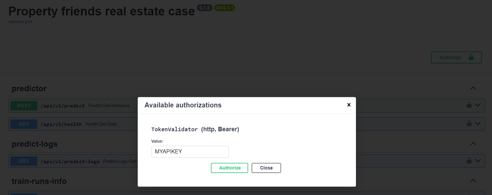
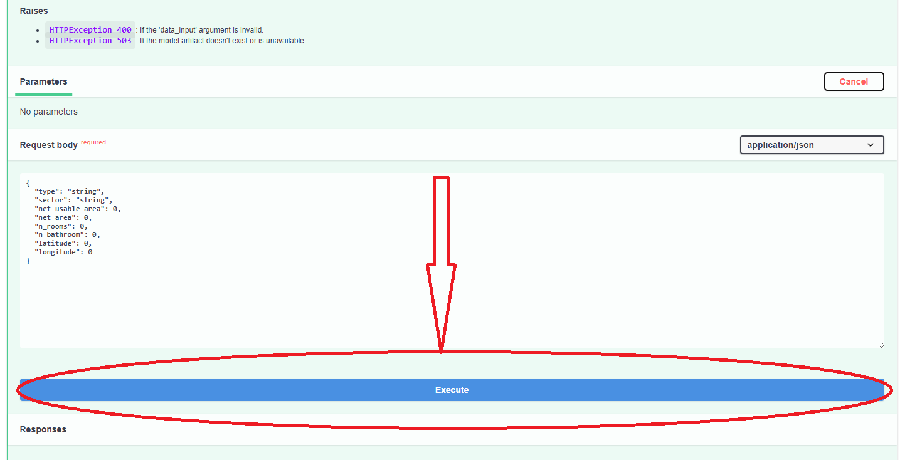
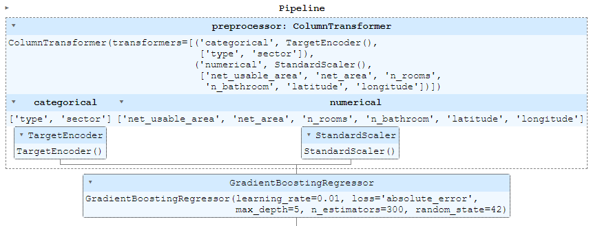

# Property Friends Real Estate Case

Estimate property valuations

Property Friends Real Estate Case is a FastAPI-based application designed to receive inputs and use a trained machine learning model to return predictions based on those inputs. The model is based in the one trained in this notebook [Property-Friends-basic-model.ipynb](challenge/Property-Friends-basic-model.ipynb). The application's technical requirements are established in this document [Challenge.md](challenge/Challenge.md)

## Software Requirements

- Git, to clone the repository. For reference I used v2.30.1 in Windows.
- Docker and Docker Compose for desktop. For reference I used Docker v24.0.5 and Docker Compose v2.20.2
- Other requirements are handled within the container (e.g. python dependencies, databases) so the user/host doesn't need to install them.

## Initial Setup
**All CLI commands should be run at the root of the project, that is wherever the project was pulled with git, for example `Users/Admin/my_folder/property_real_estate_friends/` where the last folder is the default name of the project.**

1. Ensure git is installed in your system. You can check in your command-line interface (CLI) of preference (cmd, powershell, shell, etc) by running:

    ```
    git --version
    ```

    The output should show something like `git version 2.30.1.windows.1`

2. Clone the repository using Git.

    ```
    git clone https://github.com/igonzalezperez/property_friends_real_estate_case.git
    ```

3. Ensure Docker and Docker Compose are installed on your system. You can check with the following CLI commands:
    ```
    docker --version
    docker-compose --version
    ```
    The output should show something like `Docker version 24.0.5, build ced0996` and `Docker Compose version v2.20.2-desktop.1`

4. Create a `.env` file in the project's root directory using the values from [.env.example](.env.example). You can do this through CLI with `copy .env.example .env` on Windows or `cp .env.example .env` on Unix-based systems (macOS, Linux).
   
5. Original data is not included in the repo, so you must have the raw data locally. Place your `train.csv` and `test.csv` files in the [ml/data/raw/](ml/data/raw/) folder.

## Running the app
### Data and model setup
#### 1. Startup Docker
Open the Docker desktop app and wait until it finishes loading, it should take a couple seconds.

#### 2. Build images and start containers
Run this command to build and start the docker containers:
```
docker-compose up -d --build
```
This will take about a minute when run for the first time. The process runs two containers, one for the app itself and another one for the postgres database, the logs for each one upon startup can be inspected with:
```
docker-compose logs app
docker-comose logs db
```
And they should look like this:

<details>
  <summary><i>docker-compose logs app</i>. Click to expand/collapse</summary>
<pre><code>
app  | INFO:     Started server process [1]
app  | INFO:     Waiting for application startup.
app  | 2024-01-22 14:18:00.039 | WARNING  | app.services.predict:load:73 - Machine learning model at ml/models/trained_model/model.pkl doesn't exist
app  | INFO:     Application startup complete.
app  | INFO:     Uvicorn running on http://0.0.0.0:8080 (Press CTRL+C to quit)
  </code></pre>
</details>
<details>
  <summary><i>docker-compose logs db</i>. Click to expand/collapse</summary>
<pre><code>
db  | The files belonging to this database system will be owned by user "postgres".
db  | This user must also own the server process.
db  | 
db  | 
db  | The database cluster will be initialized with locale "en_US.utf8".
db  | The default database encoding has accordingly been set to "UTF8".
db  | The default text search configuration will be set to "english".
db  | 
db  | 
db  | Data page checksums are disabled.
db  | 
db  |
db  | fixing permissions on existing directory /var/lib/postgresql/data ... ok
db  | creating subdirectories ... ok
db  | selecting dynamic shared memory implementation ... posix
db  | selecting default max_connections ... 100
db  | selecting default shared_buffers ... 128MB
db  | selecting default time zone ... Etc/UTC
db  | creating configuration files ... ok
db  | running bootstrap script ... ok
  </code></pre>
</details>

#### 3. Create a model artifact
Run ML pipelines to setup postgres DB tables, load data, transform it, train predictive model and store it. First we need to open a CLI within the container with this command:
```
docker exec -it app /bin/bash
```
The CLI will display something like `root@b2e2a41e9a7c:/real-estate-price-prediction#`, in there run this:
```
make ml-pipeline
```
When the pipeline finishes (~1 minute), the model will be stored and available for the API endpoints. At the end of the process these logs should appear:

```
Scheduled 3 tasks of which:
* 3 ran successfully:
    - 1 BuildFeatures(...)
    - 1 MakeDataset(input_dir=ml/data/raw, input_file=train.csv, input_test_file=test.csv, output_dir=ml/data/interim)
    - 1 TrainModel()

This progress looks :) because there were no failed tasks or missing dependencies

===== Luigi Execution Summary =====
```
The complete logs can be inspected below.
<details>
  <summary><i>make ml-pipeline</i>. Click to expand/collapse</summary>
<pre><code>
poetry run python ml/pipelines/luigi_tasks.py
DEBUG: Checking if TrainModel() is complete
/.venv/lib/python3.11/site-packages/luigi/parameter.py:296: UserWarning: Parameter "input_dir" with value "ml/data/interim" is not of type string.
  warnings.warn('Parameter "{}" with value "{}" is not of type string.'.format(param_name, param_value))
/.venv/lib/python3.11/site-packages/luigi/parameter.py:296: UserWarning: Parameter "output_data_dir" with value "ml/data/processed" is not of type string.
  warnings.warn('Parameter "{}" with value "{}" is not of type string.'.format(param_name, param_value))
DEBUG: Checking if BuildFeatures(input_dir=ml/data/interim, input_file=interim_train.csv, input_test_file=interim_test.csv, output_data_dir=ml/data/processed, output_model_dir=ml/models) is complete
INFO: Informed scheduler that task   TrainModel__99914b932b   has status   PENDING
DEBUG: Checking if MakeDataset(input_dir=ml/data/raw, input_file=train.csv, input_test_file=test.csv, output_dir=ml/data/interim) is complete
INFO: Informed scheduler that task   BuildFeatures_ml_data_interim_interim_train_cs_interim_test_csv_8a8efa73a6   has status   PENDING
INFO: Informed scheduler that task   MakeDataset_ml_data_raw_train_csv_test_csv_2f6931b3c8   has status   PENDING
INFO: Done scheduling tasks
INFO: Running Worker with 1 processes
DEBUG: Asking scheduler for work...
DEBUG: Pending tasks: 3
INFO: [pid 43] Worker Worker(salt=3907377044, workers=1, host=f6c763ecf6b5, username=root, pid=43) running   MakeDataset(input_dir=ml/data/raw, input_file=train.csv, input_test_file=test.csv, output_dir=ml/data/interim)
2024-01-22 14:26:02.366 | INFO     | ml.pipelines.make_dataset:init_raw_data_table:53 - Creating `raw_data` table if it doesn't exist
2024-01-22 14:26:02.514 | INFO     | ml.pipelines.make_dataset:init_raw_data_table:60 - Table `raw_data` is empty, inserting data
2024-01-22 14:26:03.360 | INFO     | ml.pipelines.make_dataset:init_raw_data_table:71 - 

        +--------------+--------------+-------------------+------------+-----------+--------------+------------+-------------+---------+------------+
| type         | sector       |   net_usable_area |   net_area |   n_rooms |   n_bathroom |   latitude |   longitude |   price | is_train   |
+==============+==============+===================+============+===========+==============+============+=============+=========+============+
| departamento | vitacura     |               140 |        170 |         4 |            4 |   -33.4012 |    -70.5806 |   11900 | True       |
+--------------+--------------+-------------------+------------+-----------+--------------+------------+-------------+---------+------------+
| casa         | la reina     |               225 |        659 |         4 |            3 |   -33.4434 |    -70.5692 |   17900 | True       |
+--------------+--------------+-------------------+------------+-----------+--------------+------------+-------------+---------+------------+
| casa         | las condes   |               110 |        200 |         3 |            3 |   -33.3932 |    -70.5505 |   10300 | True       |
+--------------+--------------+-------------------+------------+-----------+--------------+------------+-------------+---------+------------+
| departamento | lo barnechea |               250 |        250 |         3 |            4 |   -33.3567 |    -70.5426 |   30000 | True       |
+--------------+--------------+-------------------+------------+-----------+--------------+------------+-------------+---------+------------+
| departamento | providencia  |                70 |         79 |         2 |            2 |   -33.4442 |    -70.6132 |    5700 | True       |
+--------------+--------------+-------------------+------------+-----------+--------------+------------+-------------+---------+------------+
                
2024-01-22 14:26:03.360 | INFO     | ml.pipelines.make_dataset:pipeline:116 - Reading data from DB
2024-01-22 14:26:03.619 | INFO     | ml.pipelines.make_dataset:pipeline:143 - Merging train-test data and shuffling rows to create new split
2024-01-22 14:26:04.114 | INFO     | ml.pipelines.make_dataset:pipeline:156 - Dropping all rows with target less or equal than 0
2024-01-22 14:26:04.115 | INFO     | ml.pipelines.make_dataset:pipeline:162 - Dropped 1 train cols
2024-01-22 14:26:04.116 | INFO     | ml.pipelines.make_dataset:pipeline:163 - Dropped 0 test cols
2024-01-22 14:26:04.118 | INFO     | ml.pipelines.make_dataset:pipeline:168 - Saving data to ml/data/interim/interim_train.csv
2024-01-22 14:26:04.118 | INFO     | ml.pipelines.make_dataset:pipeline:169 - Saving data to ml/data/interim/interim_test.csv
2024-01-22 14:26:04.252 | SUCCESS  | ml.pipelines.make_dataset:pipeline:172 - Successfully ran MakeDataset
INFO: [pid 43] Worker Worker(salt=3907377044, workers=1, host=f6c763ecf6b5, username=root, pid=43) done      MakeDataset(input_dir=ml/data/raw, input_file=train.csv, input_test_file=test.csv, output_dir=ml/data/interim)
DEBUG: 1 running tasks, waiting for next task to finish
INFO: Informed scheduler that task   MakeDataset_ml_data_raw_train_csv_test_csv_2f6931b3c8   has status   DONE
DEBUG: Asking scheduler for work...
DEBUG: Pending tasks: 2
INFO: [pid 43] Worker Worker(salt=3907377044, workers=1, host=f6c763ecf6b5, username=root, pid=43) running   BuildFeatures(input_dir=ml/data/interim, input_file=interim_train.csv, input_test_file=interim_test.csv, output_data_dir=ml/data/processed, output_model_dir=ml/models)
2024-01-22 14:26:04.262 | INFO     | ml.pipelines.build_features:pipeline:73 - Load data pipeline config.
2024-01-22 14:26:04.267 | INFO     | ml.pipelines.build_features:pipeline:75 - Start processing data.
2024-01-22 14:26:04.267 | INFO     | ml.pipelines.build_features:pipeline:79 - Reading data from: ml/data/interim/interim_train.csv
2024-01-22 14:26:04.285 | INFO     | ml.pipelines.build_features:pipeline:82 - Data cols: ['type', 'sector', 'net_usable_area', 'net_area', 'n_rooms', 'n_bathroom', 'latitude', 'longitude', 'price', 'is_train']
2024-01-22 14:26:04.285 | INFO     | ml.pipelines.build_features:pipeline:83 - Feature cols: ['type', 'sector', 'net_usable_area', 'net_area', 'n_rooms', 'n_bathroom', 'latitude', 'longitude']
2024-01-22 14:26:04.285 | INFO     | ml.pipelines.build_features:pipeline:84 - Categorical cols: ['type', 'sector']
2024-01-22 14:26:04.285 | INFO     | ml.pipelines.build_features:pipeline:85 - Numerical cols: ['net_usable_area', 'net_area', 'n_rooms', 'n_bathroom', 'latitude', 'longitude']
2024-01-22 14:26:04.285 | INFO     | ml.pipelines.build_features:pipeline:86 - Target col: price
2024-01-22 14:26:04.285 | INFO     | ml.pipelines.build_features:pipeline:104 - Fitting preprocessing pipeline
2024-01-22 14:26:04.326 | INFO     | ml.pipelines.build_features:pipeline:109 - Succesfully fitted pipeline: 
Pipeline(steps=[('preprocessor',
                 ColumnTransformer(transformers=[('categorical',
                                                  TargetEncoder(),
                                                  ['type', 'sector']),
                                                 ('numerical', StandardScaler(),
                                                  ['net_usable_area',
                                                   'net_area', 'n_rooms',
                                                   'n_bathroom', 'latitude',
                                                   'longitude'])]))])
2024-01-22 14:26:04.337 | INFO     | ml.pipelines.build_features:pipeline:115 - Saving preprocessed data to: ml/data/processed/processed_train.csv
2024-01-22 14:26:04.510 | INFO     | ml.pipelines.build_features:pipeline:118 - Reading data from: ml/data/interim/interim_test.csv
2024-01-22 14:26:04.527 | INFO     | ml.pipelines.build_features:pipeline:129 - Saving preprocessed data to: ml/data/processed/processed_test.csv
2024-01-22 14:26:04.623 | INFO     | ml.pipelines.build_features:pipeline:132 - Saving preprocessing pipeline to: ml/models/preproc_pipeline.joblib
2024-01-22 14:26:04.631 | SUCCESS  | ml.pipelines.build_features:pipeline:135 - Successfully ran BuildFeatures
INFO: [pid 43] Worker Worker(salt=3907377044, workers=1, host=f6c763ecf6b5, username=root, pid=43) done      BuildFeatures(input_dir=ml/data/interim, input_file=interim_train.csv, input_test_file=interim_test.csv, output_data_dir=ml/data/processed, output_model_dir=ml/models)
DEBUG: 1 running tasks, waiting for next task to finish
INFO: Informed scheduler that task   BuildFeatures_ml_data_interim_interim_train_cs_interim_test_csv_8a8efa73a6   has status   DONE
DEBUG: Asking scheduler for work...
DEBUG: Pending tasks: 1
INFO: [pid 43] Worker Worker(salt=3907377044, workers=1, host=f6c763ecf6b5, username=root, pid=43) running   TrainModel()
2024-01-22 14:26:04.641 | INFO     | ml.pipelines.train_model:pipeline:63 - Load data pipeline config.
2024-01-22 14:26:04.646 | INFO     | ml.pipelines.train_model:pipeline:65 - Start building features.
2024-01-22 14:26:04.646 | INFO     | ml.pipelines.train_model:pipeline:72 - Reading preprocessed data from: ml/data/interim/interim_train.csv
2024-01-22 14:26:04.662 | INFO     | ml.pipelines.train_model:pipeline:74 - Reading processing pipeline data from: ml/models/preproc_pipeline.joblib
2024-01-22 14:26:04.667 | INFO     | ml.pipelines.train_model:pipeline:77 - Model Features: ['type', 'sector', 'net_usable_area', 'net_area', 'n_rooms', 'n_bathroom', 'latitude', 'longitude']
2024-01-22 14:26:04.667 | INFO     | ml.pipelines.train_model:pipeline:78 - Model Target: price
2024-01-22 14:26:04.668 | INFO     | ml.pipelines.train_model:pipeline:80 - Model Type: <class 'sklearn.ensemble._gb.GradientBoostingRegressor'>
2024-01-22 14:26:04.668 | INFO     | ml.pipelines.train_model:pipeline:81 - Model Params: {'learning_rate': 0.01, 'n_estimators': 300, 'max_depth': 5, 'random_state': 42, 'loss': 'absolute_error'}
2024-01-22 14:26:04.668 | INFO     | ml.pipelines.train_model:pipeline:86 - Training model: <class 'sklearn.ensemble._gb.GradientBoostingRegressor'> with parameters: {'n_estimators': 300, 'learning_rate': 0.01, 'loss': 'absolute_error', 'criterion': 'friedman_mse', 'min_samples_split': 2, 'min_samples_leaf': 1, 'min_weight_fraction_leaf': 0.0, 'subsample': 1.0, 'max_features': None, 'max_depth': 5, 'min_impurity_decrease': 0.0, 'ccp_alpha': 0.0, 'init': None, 'random_state': 42, 'alpha': 0.9, 'verbose': 0, 'max_leaf_nodes': None, 'warm_start': False, 'validation_fraction': 0.1, 'n_iter_no_change': None, 'tol': 0.0001}
2024/01/22 14:26:04 INFO mlflow.store.db.utils: Creating initial MLflow database tables...
2024/01/22 14:26:05 INFO mlflow.store.db.utils: Updating database tables
INFO  [alembic.runtime.migration] Context impl SQLiteImpl.
INFO  [alembic.runtime.migration] Will assume non-transactional DDL.
INFO  [alembic.runtime.migration] Running upgrade  -> 451aebb31d03, add metric step
INFO  [alembic.runtime.migration] Running upgrade 451aebb31d03 -> 90e64c465722, migrate user column to tags
INFO  [alembic.runtime.migration] Running upgrade 90e64c465722 -> 181f10493468, allow nulls for metric values
INFO  [alembic.runtime.migration] Running upgrade 181f10493468 -> df50e92ffc5e, Add Experiment Tags Table
INFO  [alembic.runtime.migration] Running upgrade df50e92ffc5e -> 7ac759974ad8, Update run tags with larger limit
INFO  [alembic.runtime.migration] Running upgrade 7ac759974ad8 -> 89d4b8295536, create latest metrics table
INFO  [89d4b8295536_create_latest_metrics_table_py] Migration complete!
INFO  [alembic.runtime.migration] Running upgrade 89d4b8295536 -> 2b4d017a5e9b, add model registry tables to db
INFO  [2b4d017a5e9b_add_model_registry_tables_to_db_py] Adding registered_models and model_versions tables to database.
INFO  [2b4d017a5e9b_add_model_registry_tables_to_db_py] Migration complete!
INFO  [alembic.runtime.migration] Running upgrade 2b4d017a5e9b -> cfd24bdc0731, Update run status constraint with killed
INFO  [alembic.runtime.migration] Running upgrade cfd24bdc0731 -> 0a8213491aaa, drop_duplicate_killed_constraint
INFO  [alembic.runtime.migration] Running upgrade 0a8213491aaa -> 728d730b5ebd, add registered model tags table
INFO  [alembic.runtime.migration] Running upgrade 728d730b5ebd -> 27a6a02d2cf1, add model version tags table
INFO  [alembic.runtime.migration] Running upgrade 27a6a02d2cf1 -> 84291f40a231, add run_link to model_version
INFO  [alembic.runtime.migration] Running upgrade 84291f40a231 -> a8c4a736bde6, allow nulls for run_id
INFO  [alembic.runtime.migration] Running upgrade a8c4a736bde6 -> 39d1c3be5f05, add_is_nan_constraint_for_metrics_tables_if_necessary
INFO  [alembic.runtime.migration] Running upgrade 39d1c3be5f05 -> c48cb773bb87, reset_default_value_for_is_nan_in_metrics_table_for_mysql
INFO  [alembic.runtime.migration] Running upgrade c48cb773bb87 -> bd07f7e963c5, create index on run_uuid
INFO  [alembic.runtime.migration] Running upgrade bd07f7e963c5 -> 0c779009ac13, add deleted_time field to runs table
INFO  [alembic.runtime.migration] Running upgrade 0c779009ac13 -> cc1f77228345, change param value length to 500
INFO  [alembic.runtime.migration] Running upgrade cc1f77228345 -> 97727af70f4d, Add creation_time and last_update_time to experiments table
INFO  [alembic.runtime.migration] Running upgrade 97727af70f4d -> 3500859a5d39, Add Model Aliases table
INFO  [alembic.runtime.migration] Running upgrade 3500859a5d39 -> 7f2a7d5fae7d, add datasets inputs input_tags tables
INFO  [alembic.runtime.migration] Running upgrade 7f2a7d5fae7d -> 2d6e25af4d3e, increase max param val length from 500 to 8000
INFO  [alembic.runtime.migration] Running upgrade 2d6e25af4d3e -> acf3f17fdcc7, add storage location field to model versions
INFO  [alembic.runtime.migration] Context impl SQLiteImpl.
INFO  [alembic.runtime.migration] Will assume non-transactional DDL.
/.venv/lib/python3.11/site-packages/_distutils_hack/__init__.py:18: UserWarning: Distutils was imported before Setuptools, but importing Setuptools also replaces the `distutils` module in `sys.modules`. This may lead to undesirable behaviors or errors. To avoid these issues, avoid using distutils directly, ensure that setuptools is installed in the traditional way (e.g. not an editable install), and/or make sure that setuptools is always imported before distutils.
  warnings.warn(
/.venv/lib/python3.11/site-packages/_distutils_hack/__init__.py:33: UserWarning: Setuptools is replacing distutils.
  warnings.warn("Setuptools is replacing distutils.")
2024-01-22 14:26:25.713 | INFO     | ml.pipelines.utils:log_metrics:137 - root_mean_squared_error_train = 5895.088381910986
2024-01-22 14:26:25.713 | INFO     | ml.pipelines.utils:log_metrics:137 - mean_absolute_percentage_error_train = 0.61472472245625
2024-01-22 14:26:25.714 | INFO     | ml.pipelines.utils:log_metrics:137 - mean_absolute_error_train = 2584.07877801153
2024-01-22 14:26:25.739 | INFO     | ml.pipelines.train_model:pipeline:138 - Reading preprocessed TEST data from: ml/data/interim/interim_train.csv
2024-01-22 14:26:25.805 | INFO     | ml.pipelines.utils:log_metrics:137 - root_mean_squared_error_test = 6350.305733584391
2024-01-22 14:26:25.805 | INFO     | ml.pipelines.utils:log_metrics:137 - mean_absolute_percentage_error_test = 0.4960432464173709
2024-01-22 14:26:25.806 | INFO     | ml.pipelines.utils:log_metrics:137 - mean_absolute_error_test = 2701.3382863905817
2024-01-22 14:26:25.829 | DEBUG    | ml.pipelines.train_model:pipeline:152 - file:ml/models/mlflow/mlruns
2024-01-22 14:26:25.844 | DEBUG    | ml.pipelines.train_model:pipeline:153 - file:///real-estate-price-prediction/ml/models/mlflow/mlruns/1/0106e0314ad54a45a6b407ffc8c24083/artifacts
2024-01-22 14:26:25.864 | SUCCESS  | ml.pipelines.train_model:pipeline:154 - Successfully ran TrainModel
INFO: [pid 43] Worker Worker(salt=3907377044, workers=1, host=f6c763ecf6b5, username=root, pid=43) done      TrainModel()
INFO  [luigi-interface] [pid 43] Worker Worker(salt=3907377044, workers=1, host=f6c763ecf6b5, username=root, pid=43) done      TrainModel()
DEBUG: 1 running tasks, waiting for next task to finish
DEBUG [luigi-interface] 1 running tasks, waiting for next task to finish
INFO: Informed scheduler that task   TrainModel__99914b932b   has status   DONE
INFO  [luigi-interface] Informed scheduler that task   TrainModel__99914b932b   has status   DONE
DEBUG: Asking scheduler for work...
DEBUG [luigi-interface] Asking scheduler for work...
DEBUG: Done
DEBUG [luigi-interface] Done
DEBUG: There are no more tasks to run at this time
DEBUG [luigi-interface] There are no more tasks to run at this time
INFO: Worker Worker(salt=3907377044, workers=1, host=f6c763ecf6b5, username=root, pid=43) was stopped. Shutting down Keep-Alive thread
INFO  [luigi-interface] Worker Worker(salt=3907377044, workers=1, host=f6c763ecf6b5, username=root, pid=43) was stopped. Shutting down Keep-Alive thread
INFO: 
===== Luigi Execution Summary =====

Scheduled 3 tasks of which:
* 3 ran successfully:
    - 1 BuildFeatures(...)
    - 1 MakeDataset(input_dir=ml/data/raw, input_file=train.csv, input_test_file=test.csv, output_dir=ml/data/interim)
    - 1 TrainModel()

This progress looks :) because there were no failed tasks or missing dependencies

===== Luigi Execution Summary =====

INFO  [luigi-interface] 
===== Luigi Execution Summary =====

Scheduled 3 tasks of which:
* 3 ran successfully:
    - 1 BuildFeatures(...)
    - 1 MakeDataset(input_dir=ml/data/raw, input_file=train.csv, input_test_file=test.csv, output_dir=ml/data/interim)
    - 1 TrainModel()

This progress looks :) because there were no failed tasks or missing dependencies

===== Luigi Execution Summary =====
  </code></pre>
</details>

### App usage
#### Docs page
Go to <http://localhost:8080/docs> in your browser, this will show the docs of the API using the [swagger UI](https://petstore.swagger.io/?_gl=1*khokz4*_gcl_au*ODA0MDEyODA3LjE3MDU5MzM4OTA.&_ga=2.217028630.1810789167.1705933890-78166333.1705933890), in there you can test all the endpoints.

#### API key authentication
1. Upon starting the app, a valid API key will be created and stored at `app/valid_keys/api_keys.json`, you can copy the API key in there and paste it when prompted for it in the Authorize button of the UI.


Click on the Authorize button.

A prompt will appear, paste the valid API key and click on Authorize.

<br>
Close the prompt.
<br>

<br>
Now the Authorize button shows a locked padlock which means all of our requests will be authenticated.
<br>

### Testing endpoints
Click on the swagger endpoint entries, each one will show the following:
- **Docs**: Endpoint description, input, output and http exceptions.
- **Parameters**: Endpoint parameters if it has any.
- **Request body**: An example of a valid http request for that endpoint.
- **Curl and request URL**: When testing the endpoint, it will show the request being sent (curl command), the endpoint route and the response. If needed, the `curl` command can be copied and pasted to test the endopints through CLI or some other platform like Postman.
- **Responses**: Possible endpoint responses, either 200 (successful) or errors.

Each endpoint has a "Try it out" button, press it and then press the "Execute" button to test the endpoint with a pre-filled payload.


Click on the Authorize button.


These are the available endpoints:
- **/api/v1/predict**: POST a payload containing a row of the model's inputs to receive a price prediction.
- **/api/v1/health**: GET the health status of the application, specifically checks the /predict endpoint.
- **/api/v1/predict-logs?limit=10**: GET last N recent calls to the predict endpoint. Where N is received as a parameter in the request
- **/api/v1/model-runs**: GET metadata of MLFlow model training instances.

The endpoint descriptions here are kept brief because that's what <http://localhost:8080/docs> is for, you can read the details there.

Since we passed the API key earlier, all of our requests will be successful. To test that the API authentication is actually enforced you can go to the Authorize button and logout, then try out each endpoint and see that all get a `403 Error: Forbidden` response.

Finally, at the bottom of the docs the different Schemas used can be found, these define in more detail the endpoint's inputs and outputs such as a model input or model response.


*Obs: There are also endpoint docs at <http://localhost:8080/redoc> which is just a different format to swagger but the information and features are the same.*


# Architecture and technical aspects
## Project structure
A diagram of the project's architecture is shown below.


Also the project's folders were defined using a [cookiecutter wrapper for fastapi](https://github.com/arthurhenrique/cookiecutter-fastapi). Below is the tree of the relevant files.

    root
    │
    ├── .github          # Set ci-cd pipelines
    │
    ├── app
    │   ├── api          # Defines api endpoints
    │   ├── core         # App configuration, startup events, logging, api key auth
    │   ├── logs 
    |   |   └── model_predictions.json  # Logs for the /predict endpoint
    │   ├── models       # pydantic models for inputs and responses
    │   ├── services     # Handles model artifact loading and predicting
    │   ├── valid_keys
    |   |   └── api_keys.json  # Stores valid api keys
    │   └── main.py      # Runs the app
    |
    ├── config  # Config files for formatters and linters
    │
    ├── ml
    |   ├── data
    |   |   ├── db          # Posrgres db files (created by the container)
    |   |   ├── examples    # Sample data input
    |   |   ├── interim     # Data transformed from `raw`
    |   |   ├── processed   # Data transformed from `interim`
    |   |   └── raw         # Raw data (.csv)
    |   ├── models
    |   |   ├── mlflow         # Store training runs
    |   |   ├── trained_model  # Contains model.pkl and metadata files from MLFlow
    |   |   └── preproc_pipeline.joblib  # Pipeline to create features
    |   └── pipelines
    |       ├── build_features.py  # Create data features
    |       ├── luigi_tasks.py     # Orchestrates the other three pipelines
    |       ├── make_dataset.py    # Load and clean raw data and store it interim
    |       |                      # Add raw data to database if it's not there yet
    |       ├── pipeline_config.yml  # Pipeline info like feature cols,
    |       |                        # targets, transformations and model params
    |       └── train_models.py      # Train model using trained preproc_pipeline
    |                                # and interim data
    ├── tests            # Unit and integration tests
    ├── docker-compose.yml
    ├── Dockerfile
    ├── Makefile         # Define useful commands to run pipelines
    ├── pyproject.toml   # Project's dependencies
    └── poetry.lock      # Project's dependencies
## ML
### Input Data
The client would like to eventually connect the app to their databases, since the data can be represented as regular tables (DataFrames), it makes sense to use a relational database, so I chose PostgreSQL.

The [make_dataset.py](ml/pipelines/make_dataset.py) script checks if the table `raw_data` exists and if it's empty, if so then it populates with `train.csv` and `test.csv`. The table has an extra column `is_train` to indicate from which dataset came each row and preserve the train-test split if necessary.

### Data/ML Pipelines
The framework used to orchestrate the data/ml pipelines is [Luigi](https://luigi.readthedocs.io/en/stable/running_luigi.html) which is package that helps you build complex pipelines of batch jobs, developed by spotify. I chose it because it's very simple and easy to use. I considered using Airflow, [but it seems to have heavy of requirements when using Docker](https://airflow.apache.org/docs/apache-airflow/stable/howto/docker-compose/index.html) and [some issues when installed through dependency managers other than pip](https://airflow.apache.org/docs/apache-airflow/2.1.2/installation.html) (poetry), I also considered [Prefect](https://www.prefect.io/), but it had a dependency conflict with FastAPI dependencies and I'd rather prioritize FastAPI dependencies.

Luigi works by defining "Tasks", all of which have a set of inputs and outputs, and a process inbetween, so Luigi checks if the output exists for the task, if not then the task is run, if it exists the tasks is considered finished. This makes Luigi idempotent, that is if I run a task succsefully once, the next runs will have no effect because the output already exists. Additionally Luigi allows for task dependency, so the pipeline can be defined in a straitforward manner like this: `make_dataset > build_features > train_model`. So running `train_model` task will trigger the previous dependencies.

The parameters used to create features and train the model are abstracted into [ml/pipelines/pipeline_config.yml](ml/pipelines/pipeline_config.yml), so it's easy to try new setups just by editing it.

#### Make Dataset
Loads the original .csv files. If DB is empty, it loads the data to the `raw_data` table. This step is meant to then be used for data cleaning, in this case it only removes rows with `price = 0` and then saves the output to [ml/data/interim/](ml/data/interim/). It can also re-shuffle the dataset to create a new train-test split, but this is not enabled by default.

#### Build Features
Loads the output of `make_dataset` and fits a preprocessing sklearn pipeline using the defined parameters in [ml/pipelines/pipeline_config.yml](ml/pipelines/pipeline_config.yml), namely the TargetEncoder. It saves the fitted pipeline in [ml/models/](ml/models/) as well as the transformed data (`pipeline.transfrom(data)`), the latter is stored just in case, it's not used later. Since the challenge states that the idea is just to productivize the original model, [ml/pipelines/pipeline_config.yml](ml/pipelines/pipeline_config.yml) only includes a categorical column transformer. There's also a numerical transformer with a StandardScaler commented out, it can be uncommented to use a more robust model.

#### Train Model
Loads the data at [ml/data/interim/](ml/data/interim/), the fitted preprocessing pipeline at [ml/models/](ml/models/) and trains the model with the parameters in [ml/pipelines/pipeline_config.yml](ml/pipelines/pipeline_config.yml).

## API
For the API I used FastAPI because of its ease of use and automatic documentation with swagger. Along with 
The MLFlow framework is used to log model training, this tool allows to create artifacts, metrics and metadata every time a training is performed, so all runs of the model are stored. All runs are saved in [ml/models/mlflow/](ml/models/mlflow/), specifically in the folder mlruns where artifacts are stored and it also instantiates a sqlite db for logs and metadata, which can be queried. This information is used by the `/model-runs` endpoint. Finally the most recent model is always stored at [ml/models/trained_model](ml/models/trained_model/) which contains a `model.pkl` file which is the one consumed by the API.


## Issues with the original notebook and improvements
The [input notebook](challenge/Property-Friends-basic-model.ipynb) has several inconsistencies which are described below:
- Train cols are defined with 
    ```
    train_cols = [
    col for col in train.columns if col not in ['id', 'target']
    ]
    ```
but neither `"id"` not `"target"` are present in the data so it doesn't do anything, so `train_cols` contains all of the original columns, including the target (`"price"`) which is an important oversight. `"target"` was probably mistaken with the variable `target` which is defined afterwards.
- Categorical transformer TargetEncoder relies on the targets to fit the categorical features, so information leakage from the target variable could be a problem.
- The sklearn preprocessing pipeline defines only a categorical column transformer, which means the numerical features are not used at all in the model. This could have been a decision and not an oversight, but it would be weird not to use information like `net_usable_area` which I would presume influences the price of an estate. Luckily, this cancels out the earlier problem of including the target in the features, since all numerical columns discarded.

  A very simple improvement would be to use a numerical column transformer with a StandardScaler so we make use of all the features. Then, a more exhaustive feature engineering phase can be carried out.
- The GradientBoostingRegressor class accepts a `random_state` variable which is not set, this is not a big deal but it affects reproducibility.
- The way in which the metrics functions are called is incorrect, according to the sklearn documentation, the correct way to call them is `metric_func(y_true, y_pred)`, while the notebook does the opposite `metric_func(y_pred, y_true)`. `RMSE` and `MAE` are symmetric so they evaluate the same in both cases, but `MAE` results do change. 
- The `MAPE` metric can be problematic, while experimenting with the data, I calculated the MAPE for the train data, and it happens to be infinity. This is due to a combination of a possible problem with the data and how the metric is implemented in sklearn, `MAPE` is calculated as:
  \[
  \text{MAPE}(y_{\text{true}}, y_{\text{pred}}) = \frac{1}{n} \sum_{i=1}^{n} \left| \frac{y_{\text{true}, i} - y_{\text{pred}, i}}{max(\epsilon, y_{\text{true}, i})} \right|
  \]

  Notice the denominator takes the max between $\epsilon$ and $y_{\text{true}, i}$ where $\epsilon$ is the smallest value that python can generate (`np.finfo(np.float64).eps`), that is a non-zero value just so the formula doesn't throw an error when $y=0$ but it will still yield an incredibly high result for the metric (unless the target and pred difference happens to be very small too).

  This made me notice that there was a row with `price = 0` in the train data, which is a very convenient price for an estate, so it needs to be removed for `MAPE` to work properly.
- The previous point also makes me question the integrity of the price data in particular, the minimum price values are around 10^1, while the top 75% are 10^4. I don't know the units but I would guess if they were changed it was through a linear transformation, so if the cheapest property were to cost 10 million CLP (a very low estimate for an estate in Chile), then the maximum would cost about 10.000 million CLP which is huge and is not even the maximum. So I would inspect if the lowest values are outliers or just bad data.
- The training should be done in a more robust way, namely using validation sets and some cross-validation strategy like K-fold cross-validation, so the metrics are more reliable.


Some of the issues mentioned are tackled in the app's data pipelines. A revised notebook with corrections can be found [here].(notebooks/Property-Friends-basic-model-fixed.ipynb). The specific changes are these:

- Explicitly define feature, numerical, categorical and target columns (see [pipeline_config.yml](ml/pipelines/pipeline_config.yml)).
- Include a numerical column transformer using StandarScaler.
- Include the `random_state` parameter for the GradientBoostingRegressor.
- Compute metrics as `metric_func(y_true, y_pred)`.
- Drop the single row with `price = 0`. Low but non-zero price rows are kept.

Below are the notebook results for comparison, we can see that the model improves noticeably with very simple corrections. Also notice the corrected metric calculations change the original model's MAPE greatly, from $0.4$ to $0.75$.

| Metric | Original Model | Revised Model |
| ------ | -------------- | ------------- |
| RMSE   | 10254.16       | 5677.22       |
| MAPE   | 0.75           | 0.67          |
| MAE    | 5859.37        | 2605.25       |

**Original model pipeline**


**Revised model pipeline**
